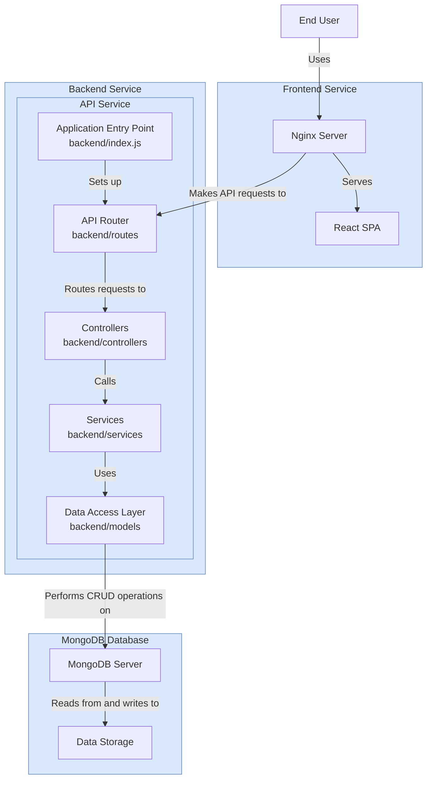
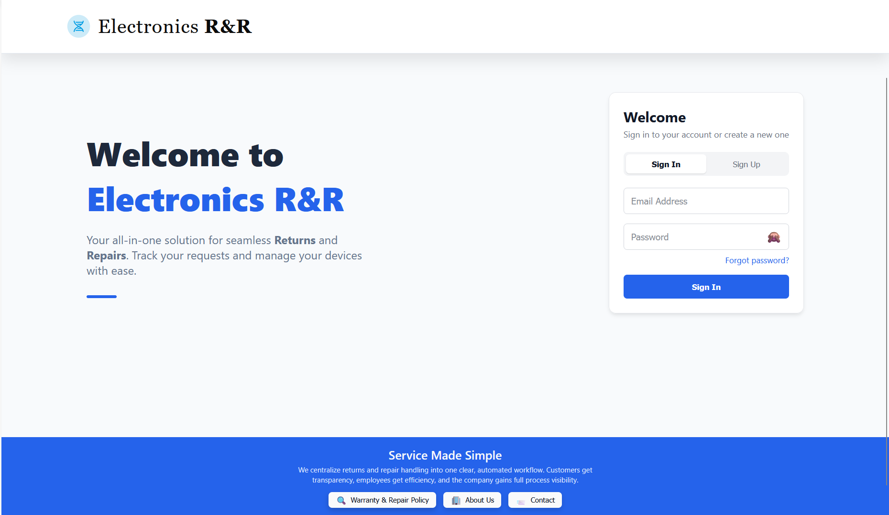
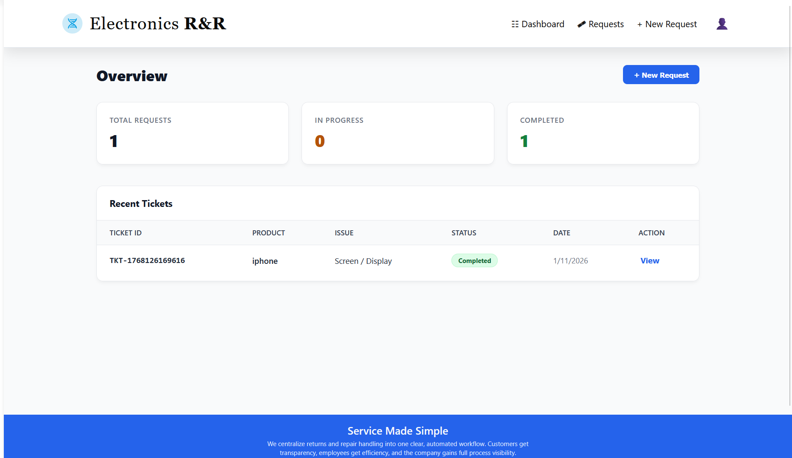
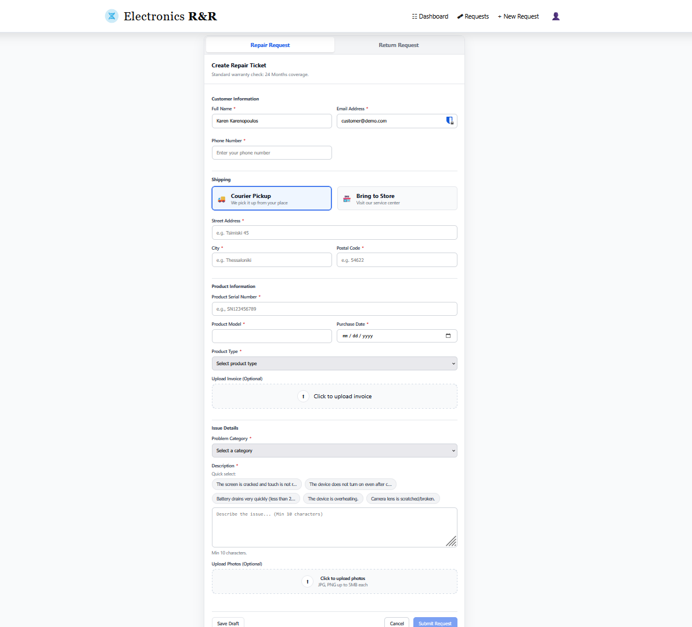
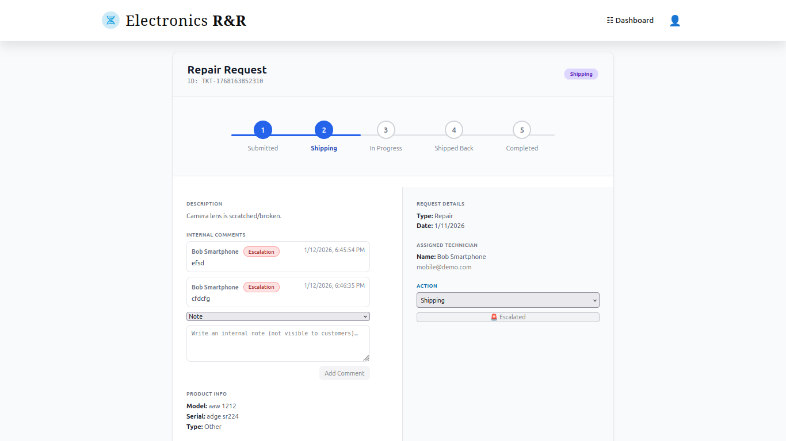
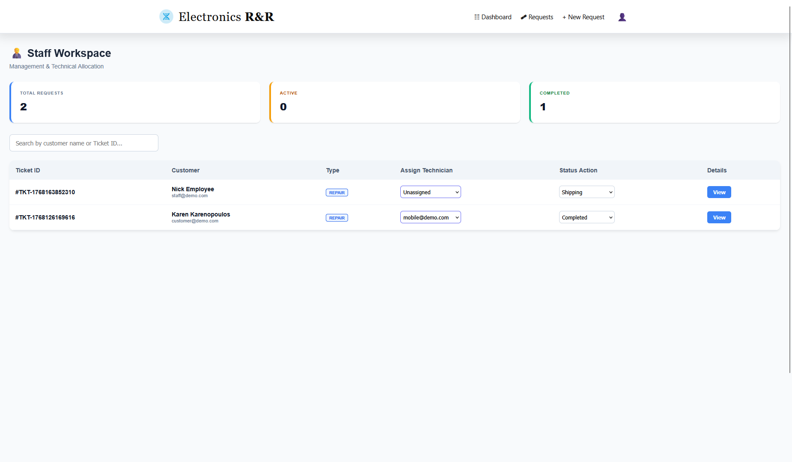
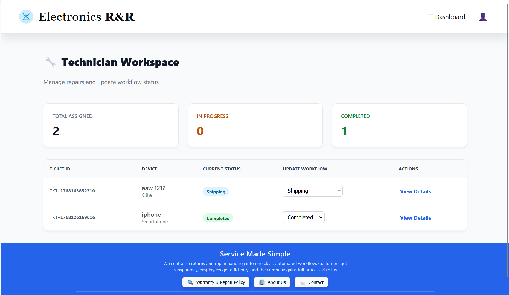
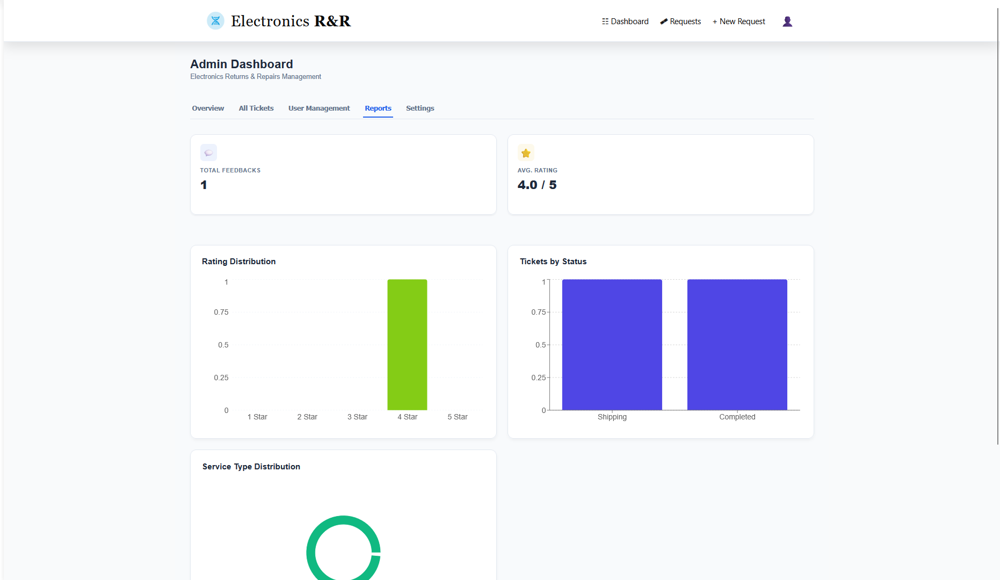
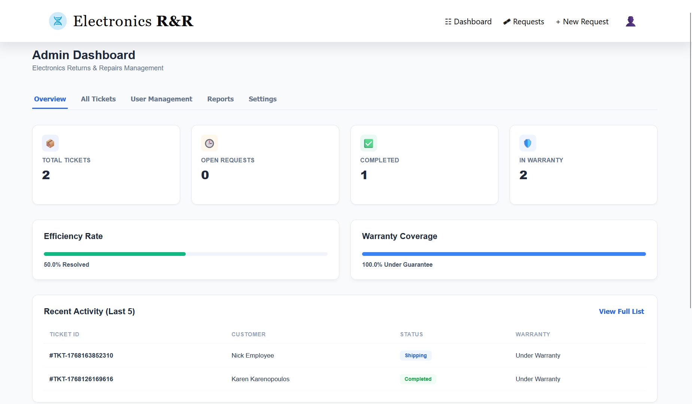

# Electronics R&R - Service Management System

A full-stack web application for managing electronic repair and return requests. Designed to streamline communication between Customers, Technicians, and Employees.

## 🏗️ System Architecture

This diagram illustrates the high-level architecture of the application, deployed via Docker Containers.

# System Architecture Diagram




## 🚀 Key Features

    Role-Based Access Control: Distinct dashboards for Customers, Technicians, Employees, and Admins.

    Ticket Lifecycle Management: Full workflow from "Submitted" to "Completed" with status tracking.

    Placement Algorithm: Smart resource allocation logic (Simulation).

    Attachments & Media: Support for photo uploads and invoice handling.

    Reporting: Automated generation of service reports.

## 📸 Screenshots


| Landing page | Customer Dashboard |
|:------------------:|:--------------------:|
|  |  |

| Create Ticket Form | Ticket details |
|:------------------:|:--------------------:|
|  |  |

| Staff Dashboard | Technician Dashboard |
|:------------------:|:--------------------:|
|  |  |

| Admin Reports | Admin Panel |
|:---------------:|:-----------:|
|  |  |


## 🛠️ Tech Stack

    Frontend: React.js, Vite, Axios, CSS Modules.

    Backend: Node.js, Express.js.

    Database: MongoDB (Mongoose ODM).

    DevOps: Docker, Docker Compose, Nginx.

    Tools: Git, GitHub Actions (CI/CD).

## 🏁 Getting Started

### Prerequisites

    Docker & Docker Compose installed.

### Installation & Run

1. Clone the repository:

```bash
    git clone [https://github.com/bjorkeen/the-refund-awakens.git](https://github.com/bjorkeen/the-refund-awakens.git)
cd the-refund-awakens
```

2. Download the two files (make sure that the name of the files are exactly the same as in the drive): 
* .env file to be added to the backend folder https://drive.google.com/file/d/1VpgRY32E7AduaYKf0RNnhR1sEgwMawAj/view?usp=drive_link 
* .env file to be added just to the project folder https://drive.google.com/file/d/1ODlLpcDRSqzchQ2pjAfRI7SPCekK0OaA/view?usp=sharing 


3. Start the application (Production Mode):

```bash
docker compose up --build
```

4. Access the app:

    Frontend: http://localhost:3000

    Backend API: http://localhost:5050

---

## 🔑 Demo Accounts

You can **Sign Up** to create a new Customer user.

* Password must contain at least 8 characters, 1 number, and 1 symbol (e.g. `Demo123!`).

Alternatively you can use one of the following demo accounts to navigate throught the different views each role has:

1. Customer 
    - Email : customer@demo.com
    - Password : demo123!

2. Employee
    - Email : staff@demo.com
    - Password : demo123!

3. Technician (Repair Center's employee)
    - Emails : 
        mobile@demo.com
        mobile2@demo.com
        tv@demo.com
        laptop@demo.com
        other@demo.com
    - Password : demo123!

5. Manager
    - Email : manager@demo.com
    - Password : demo123!

---

## Folder Structure

```
/
├── backend/                 # API code
│   ├── controllers/         # Business logic (e.g. Ticket creation, Auth)
│   ├── models/              # Mongoose Schemas (User, Ticket)
│   ├── routes/              # API Endpoints definition
│   └── services/            # Business logic services
│
├── frontend/                # React App code
│   └── src/
│       ├── components/      # Reusable UI (AuthForm, Header, etc.)
│       ├── context/         # Global State (AccessContext)
│       ├── pages/           # Pages (CreateTicket, MyTickets)
│       └── services/        # Axios calls to the Backend
│
└── docker-compose.yml       # Container configurations
```


---
