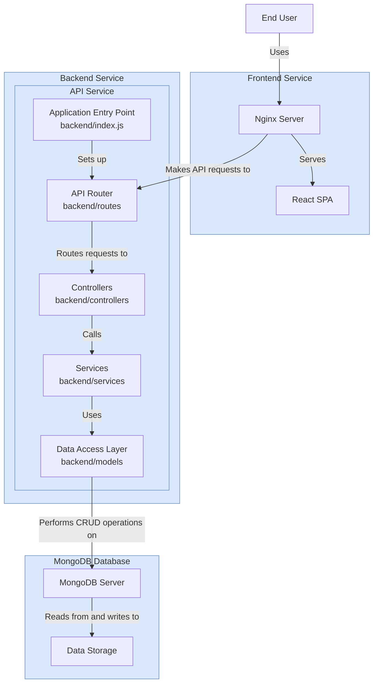

# System Architecture Diagram

## Architecture Overview

This diagram represents the three-tier architecture of the Express-React template:

1. **Frontend Service**: Nginx serving React SPA
2. **Backend Service**: Express API with layered architecture
3. **MongoDB Database**: Data persistence layer

---
*Updated: 1/11/2026*
